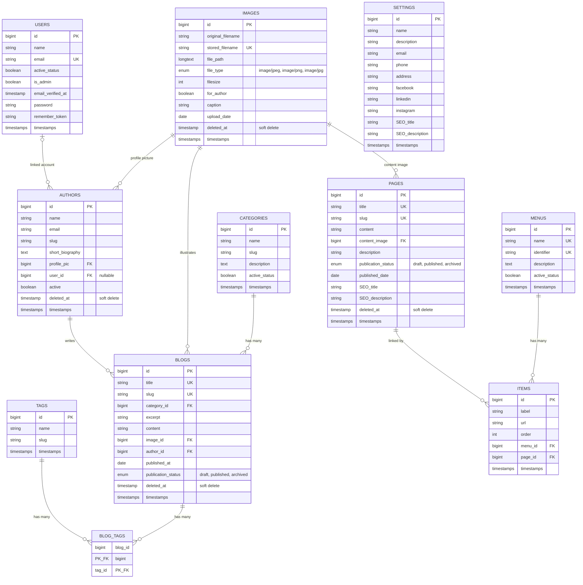

# Database Diagram

Entity-relationship diagram generated from the migrations in `database/migrations/`.
Laravel/package infrastructure tables (`sessions`, `password_reset_tokens`, `cache`, `cache_locks`, `jobs`, `job_batches`, `failed_jobs`, `personal_access_tokens`) are omitted since they don't participate in the application's domain relationships.

## Relationships

| From | To | Type | FK column | On delete |
|---|---|---|---|---|
| `blogs.category_id` | `categories.id` | many-to-one | `category_id` | cascade |
| `blogs.image_id` | `images.id` | many-to-one | `image_id` | cascade |
| `authors.profile_pic` | `images.id` | many-to-one | `profile_pic` | cascade |
| `authors.user_id` | `users.id` | many-to-one (nullable) | `user_id` | set null |
| `pages.content_image` | `images.id` | many-to-one | `content_image` | cascade |
| `blogs.author_id` | `authors.id` | many-to-one | `author_id` | cascade |
| `blog_tags.blog_id` | `blogs.id` | many-to-one | `blog_id` | cascade |
| `blog_tags.tag_id` | `tags.id` | many-to-one | `tag_id` | cascade |
| `items.menu_id` | `menus.id` | many-to-one | `menu_id` | cascade |
| `items.page_id` | `pages.id` | many-to-one (nullable) | `page_id` | cascade |

`blogs` and `tags` are joined through the `blog_tags` pivot table (composite PK on `blog_id` + `tag_id`), forming a many-to-many relationship.

`settings` has no foreign keys — it's a standalone key/value-style table for site-wide configuration.

`images`, `authors`, `blogs`, and `pages` use soft deletes (`deleted_at`).
