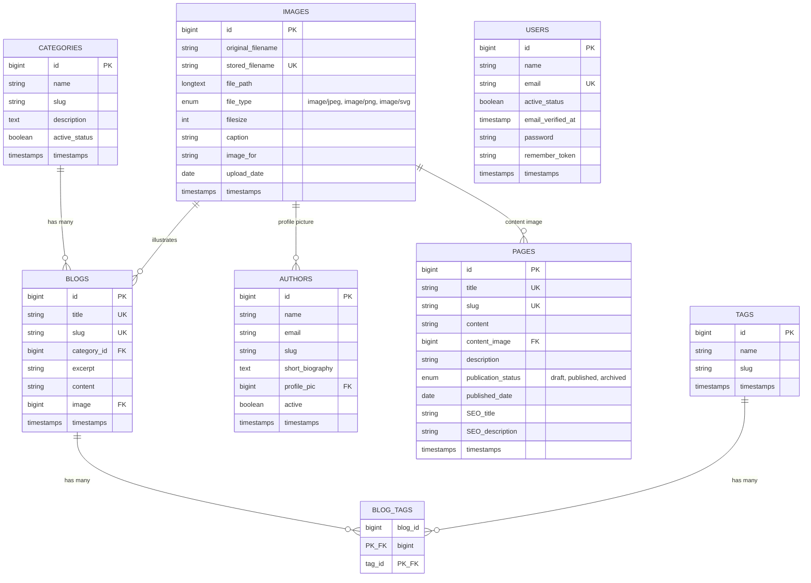

# Database Diagram

Entity-relationship diagram generated from the migrations in `database/migrations/`.
Laravel framework tables (`sessions`, `password_reset_tokens`, `cache`, `cache_locks`, `jobs`, `job_batches`, `failed_jobs`) are omitted since they don't participate in the application's domain relationships.

## Relationships

| From | To | Type | FK column | On delete |
|---|---|---|---|---|
| `blogs.category_id` | `categories.id` | many-to-one | `category_id` | cascade |
| `blogs.image` | `images.id` | many-to-one | `image` | cascade |
| `authors.profile_pic` | `images.id` | many-to-one | `profile_pic` | cascade |
| `pages.content_image` | `images.id` | many-to-one | `content_image` | cascade |
| `blog_tags.blog_id` | `blogs.id` | many-to-one | `blog_id` | cascade |
| `blog_tags.tag_id` | `tags.id` | many-to-one | `tag_id` | cascade |

`blogs` and `tags` are joined through the `blog_tags` pivot table (composite PK on `blog_id` + `tag_id`), forming a many-to-many relationship.

## Notes / observations

- `authors` is not currently linked to `blogs` (no `author_id` FK on `blogs`) — blog authorship isn't modeled yet.
- `users` has no foreign keys tying it to `blogs`, `pages`, `authors`, etc. — it appears to be used only for CMS login/auth, separate from the `authors` entity.
- `blogs.image` and `authors.profile_pic` are FK columns not suffixed with `_id`, unlike Laravel's usual convention (`category_id`, `content_image` on `pages` also breaks the pattern).
